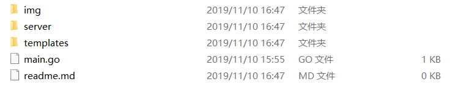
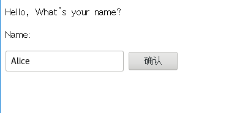
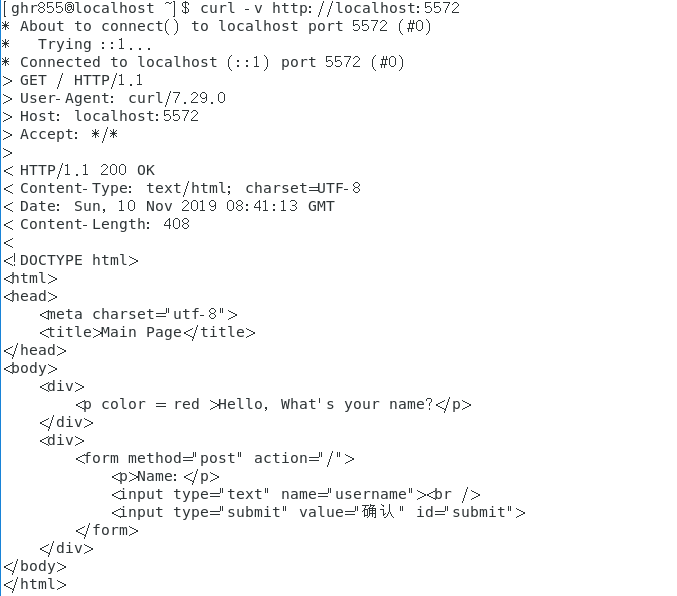
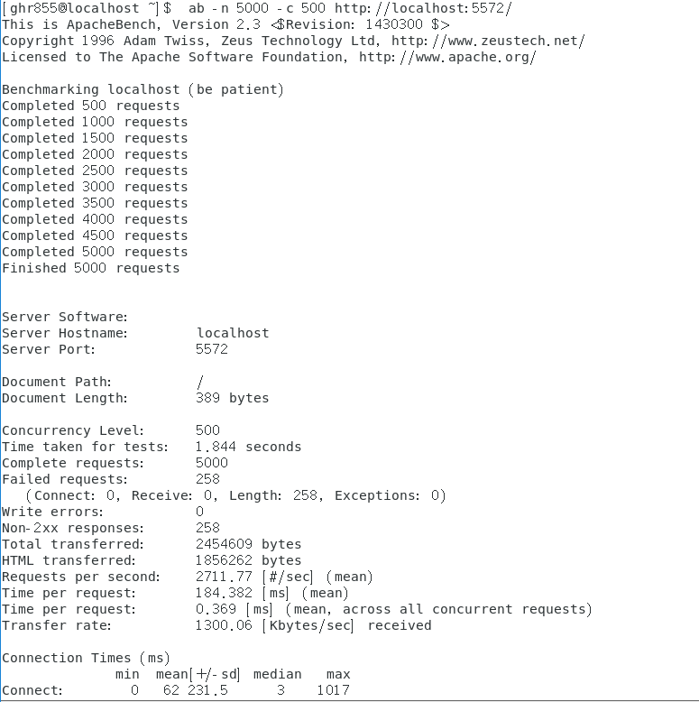

# 中山大学数据科学与计算机学院本科生实验报告
| 课程名称 | 服务计算 |   任课老师   | 潘茂林 |
| :------: | :------------------: | :----------: | :----: |
|   年级   |      2017                | 专业（方向） |     软件工程   |
|   学号   |  17343033                    |     姓名     |    郭海锐    |

## 实验名称
开发 web 服务程序

## 实验要求
- 任务目标

1. 熟悉 go 服务器工作原理
2. 基于现有 web 库，编写一个简单 web 应用类似 cloudgo。
3. 使用 curl 工具访问 web 程序
4. 对 web 执行压力测试
- 相关知识

    课件：http://blog.csdn.net/pmlpml/article/details/78404838
- 基本要求

1. 编程 web 服务程序 类似 cloudgo 应用。
    - 要求有详细的注释
    - 是否使用框架、选哪个框架自己决定 请在 README.md 说明你决策的依据
2. 使用 curl 测试，将测试结果写入 README.md
3. 使用 ab 测试，将测试结果写入 README.md。并解释重要参数。
## 实验过程

1. 编程 web 服务程序 类似 cloudgo 应用。
    - 要求有详细的注释
    - 是否使用框架、选哪个框架自己决定 请在 README.md 说明你决策的依据

    我选择的框架是`Martini`框架，它的优点在于：
    - 使用极其简单.
    - 无侵入式的设计.
    - 很好的与其他的Go语言包协同使用.
    - 超赞的路径匹配和路由.
    - 模块化的设计 - 容易插入功能件，- 也容易将其拔出来.
    - 已有很多的中间件可以直接使用.
    - 框架内已拥有很好的开箱即用的功能支持.
    - 完全兼容http.HandlerFunc接口.

    ### 环境安装
    首先需要安装相应的库，使用以下的命令

    `go get github.com/go-martini/martini`

    `go get github.com/martini-contrib/render`

    安装完环境后，即可进行操作
    
    整体结构如下：
    
    `/img`中存放相应的图片资源

    `/server`中存放服务器代码

    `/template`中存放html文件

    `readme.md`为实验报告 

    `main.go`存放main函数

    ### 主要代码

    #### `main.go`
    `main.go`有两个作用，一是确定启动的端口，通过`pflag`获取命令行输入的参数，若无输入，则使用默认的`5555`端口；二是调用`server.go`中的`Start`函数启动服务器，其代码如下:

    ```go
    package main

    import( 
        "cloudgo/server"
        "os"
        "github.com/spf13/pflag"
    )
    func main(){
        port := os.Getenv("PORT");
        if len(port) == 0{
            port = "5556"
        } //默认端口
        newport := pflag.StringP("port", "p", "5555", "the port to listen")
        pflag.Parse()//获取参数中端口
        if len(*newport) != 0{
            port = *newport
        }
        server.Start(port)//启动服务器
    }
    ```

    以上即为`main.go`中的主要内容

    #### `server.go`
    其代码如下：
    ```go
    func Start(port string){
        mar := martini.Classic()
        mar.Use(render.Renderer())
        //Get方法，当访问localhost：port时，显示templates文件夹中的hello页面
        mar.Get("/", func(r render.Render) {
            r.HTML(200, "hello", "")
        })
        //Post方法，获取表单输入，并将输入传递到main页面
        mar.Post("/",  func(w http.ResponseWriter,  re *http.Request,r render.Render) {
        re.ParseForm()
        fmt.Println(len(re.Form["username"])-1)
        for _,t := range re.Form["username"]{
            //fmt.Println(t)		
            r.HTML(200, "main",t)
        }  
        })
        mar.RunOnAddr(":"+port)  
    }
    ```

    #### `templates`文件夹中的页面

    `hello.tmpl`,代码如下
    ```html
    <!DOCTYPE html>
    <html>
    <head>
        <meta charset="utf-8">
        <title>Main Page</title>
    </head>
    <body>
        <div>
            <p>Hello, What's your name?</p>
        </div>
        <div>
            <form method="post" action="/">
                <p>Name:</p>
                <input type="text" name="username">
                <input type="submit" value="确认" id="submit">
            </form>
        </div>
    </body>
    </html>
    ```
    其效果如下
        <html>
    <head>
        <meta charset="utf-8">
        <title>Main Page</title>
    </head>
    <body>
        <div>
            <p>Hello, What's your name?</p>
        </div>
        <div>
            <form method="post" action="/">
                <p>Name:</p>
                <input type="text" name="username">
                <input type="submit" value="确认" id="submit">
            </form>
        </div>
    </body>
    </html>
    用于获取输入的名字，传递到`main`页面
    
    `main.tmpl`,其代码如下：

    ```html
    <!DOCTYPE html>
    <html>
    <head>
        <meta charset="utf-8">
        <title>Main Page</title>
    </head>
    <body>
        <div>
            <p font-weight: bold >Hello,{{.}}!</p>
        </div>

    </body>
    </html>
    ```
    ### 结果截图
    首先是输入名字：

    

    点击确认后，跳转：

    

2. 使用 curl 测试，将测试结果写入 README.md


    在终端中输入以下指令，进行测试

    `curl -v http://localhost:5572`

    结果截图：

    

    图中显示了header以及content的内容

3. 使用 ab 测试，将测试结果写入 README.md。并解释重要参数。

    ### 安装环境

    首先在终端中输入以下指令安装相应环境：

    `sudo yum -y install httpd-tools`

    ### 测试
    安装完毕后，输入以下指令进行测试：

    `ab -n 5000 -c 500 http://localhost:5572/`

    共有5000条请求

    结果如下：

    

    共用时间1.844s

## 实验心得与体会
本次实验是开发简单 web 服务程序 cloudgo，仿照了课件中的程序，综合运用了http，render等相关库的只是，以及martiny框架，并且采用了curl以及ab进行了一些比较简单的测试，通过本次实验，我对于web服务器的搭建，有了一个较为初步的了解，当然，也需要在日后的学习中不断深入认识，以上即为本次实验的心得与体会。

