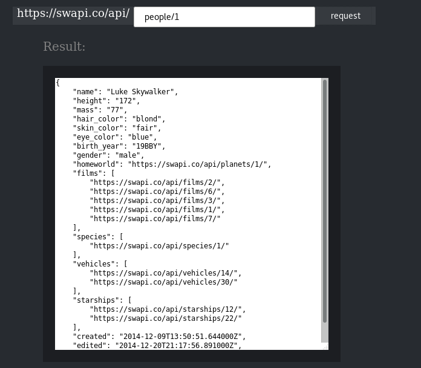

# 服务计算

## 简单 web 服务与客户端开发实战

### 1、概述

利用 web 客户端调用远端服务是服务开发本实验的重要内容。其中，要点建立 API First 的开发理念，实现前后端分离，使得团队协作变得更有效率。

#### 任务目标

1. 选择合适的 API 风格，实现从接口或资源（领域）建模，到 API 设计的过程
2. 使用 API 工具，编制 API 描述文件，编译生成服务器、客户端原型
3. 使用 Github 建立一个组织，通过 API 文档，实现 客户端项目 与 RESTful 服务项目同步开发
4. 使用 API 设计工具提供 Mock 服务，两个团队独立测试 API
使用 travis 测试相关模块

### 开发项目

- 复制 https://swapi.co/ 网站
    - 你需要想办法获取该网站所有资源与数据
    - 给出 UI 帮助客户根据明星查看相关内容
### 实验过程

#### 前端

前端，我采用了vue进行搭建，实现了`https://swapi.co/`网站的界面，效果如下：


`<template></template>`中存放网页的`html`代码

相关代码如下：
```html
<template>
<!DOCTYPE html>
<html lang="en">
<head>
<meta charset="utf-8">
<title> SWAPI - The Star Wars API </title>
<link rel="stylesheet" type="text/css" href="1.css">
</head>

<body id="b1">
  <div>
    <div class="top">
   <center> 
    <ul>
      <li id="l1"><a href="https://twitter.com/share">Tweet</a></li>
      <li id="l2"><a href="#">Home</a></li>
      <li><a href="https://swapi.co/about">About</a></li>
      <li><a href="https://swapi.co/documentation">Documentation</a></li>
    </ul>
    </center>      
  </div>


    <div id="d0">
      <p style="text-align: center"><font size = "40" color = "yellow"> SWAPI </font></p>
      <p style="text-align: center"><font size = "4" color = "yellow">The Star Wars API </font></p>
   </div>
   <div id="d1">
    <p>All the Star Wars data you've ever wanted:</p>
    <p>Planets, Spaceships, Vehicles, People, Films and Species</p>
    <p>From all SEVEN Star Wars films</p>
    <p>Now with The Force Awakens data!</p>
  </div>
    <p id="p1">Try it now! </p>
    
  <div class="container">
      <div class="parent">
          <span id="s1"> https://swapi.co/api/ </span>
          <input type="text" class="search" placeholder="搜索" v-model="content"/>
		<input type="button" class="btn" value="request" v-on:click="geta()"/>
          
      </div>
  </div>
  <div class="d3">
    <p> Result: </p>
<textarea v-model="msg" class = "res"></textarea>
   
  </div>
  <div class="d4">
    <div class="dd1"><p> What is this?</p>
The Star Wars API, or "swapi" (Swah-pee) is the world's first quantified and programmatically-accessible data source for all the data from the Star Wars canon universe!

We've taken all the rich contextual stuff from the universe and formatted into something easier to consume with software. Then we went and stuck an API on the front so you can access it all!</div>
    <div class="dd2"><p>How can I use it?</p>
All the data is accessible through our HTTP web API. Consult our documentation if you'd like to get started.

Helper libraries for popular programming languages are also provided so you can consume swapi in your favourite programming language, in a style that suits you.</div>
    <div class="dd3"><p>How can I support this?</p>
With small donations we can keep swapi running for free, please consider throwing us some beer money to say thank you. With every $10 we can keep the site up for another month!

This project is open source and you can contribute on GitHub.</div>
  </div>
  </div>
</body>
</html>


</template>
```
`<script></script>`中存放js代码，主要是利用`get`方法，获得`"http://localhost:8000/api/" + this.content`地址返回的相关数值
```html
<script>
export default {
  name: 'Swapi',
  data () {
    return {
      msg: ''
    };
},
  methods: {
 	geta: function (){
      this.$http.get("http://localhost:8000/api/" + this.content).then(
        function(res) {
          if(res.ok) {
		//alert(res.data);
		//this.msg = res.data;
            this.msg = JSON.stringify(res.data, null, 4);
          }
        }, function() {
          console.log("faile");
        });

 
	},
  }
}
</script>
```
`<style></style>`中存放相关的`css`代码

```html

<!-- Add "scoped" attribute to limit CSS to this component only -->
<style scoped>
#d1{
	margin-top: 10%;
  	text-align: center;
  	color: white;
}
#d0{
	margin-top: 100px;
	padding-top: 20px;
	height: 200px;
	background-color: rgb(28,30,34);
}

#b1{
	background-color: rgb(39,43,48);
	width: 100%;
	height: 100%;
	margin: 0 0;
}

#p1{
	padding-top: 20px;
	font-size: 30px;
	color: white;
	text-align: center;
}
#l1{
	padding-left: 0;
	margin-right: 78%;
}
.top ul{
   
    width: auto;
    list-style-type: none;
    white-space:nowrap;
    overflow: hidden;
    margin-left: 5%;
    padding: 0;

}
.top li {
    float:left;

    margin-right:2%;  
    position: relative;
    overflow: hidden;
    padding-right: 0px;
}

.top li a{
    display: block; 
    color:white;
    text-align: center;
    padding: 3px;
    overflow: hidden;
    text-decoration: none; 
    
}
.top li a:hover{
    background-color: #111;
}
.top ul li ul{
    margin-left: -0.2px;
    background:rgb(189, 181, 181);
    position: relative;
    display: none; 

}
.top ul li ul li{
    float:none;
    text-align: center;
}
.top ul li:hover ul{
    display: block;
}
.top{
	height:50px;
}

#s1{
	color: white;
	float: left;
	height: 30px;
	width: 200px;
	margin-right: 0;
	padding-right: 0;
	font-size: 18px;
	background-color: rgb(54,58,63);
	display:inline-block; 
}
.container{
	width: 600px;
	margin: 0 auto;
	text-align: center;
	display: flex;
}
.search{
	height: 30px;
	width: 300px;
}
.search {
    float: left;
    flex: 4;
    height: 30px;
    outline: none;
    box-sizing: border-box;
    padding-left: 10px;
}
.btn{
	width: 100px;
    float: right;
    flex: 1;
    height: 30px;
    background-color: rgb(54,58,63);
    color: white;
    border-style: none;
    outline: none;
}
.d3{
	width: 500px;
	margin: 0 auto;
}
.d3 p{
	color: grey;
	font-size: 20px;
}
.res{
	width: 450px;
	height: 450px;
	margin: 0 auto;
	border-style: solid;
	border-width: 20px;
	border-color: rgb(28,30,34);
}
.d4{
	font-size: 15px;
	color: white;
	width: 624px;
	margin: 0 auto;
}
.dd1{
	display: inline-block;
	margin-right: 12px;
	float: left;
	width: 200px;
	height: 400px;
	/*//background-color: blue;*/
}
.dd2{
	margin-right: 12px;
	float: left;
	display: inline-block;
	width: 200px;
	height: 400px;
	/*//background-color: blue;*/
}
.dd3{
	display: inline-block;
	width: 200px;
	height: 400px;
	/*background-color: blue;*/
}
.d4 p{
	font-size: 17px;
	text-align: center;
}
</style>
```

以上即为网页的相关代码，但是存在一些问题，我在实验过程中，发现`get`方法并没有响应，经过查找才发现，需要添加一些模块，才能响应：
```javascript
import VueResource from 'vue-resource'
Vue.use(VueResource)

Vue.config.productionTip = false
Vue.http.options.emulateJSON = true;
```

以上即为前端的内容。

#### 后端

数据爬取：

swapi网站在github中，有提供api接口，供我们获取相关的资源，因此，我们可以通过他们提供的借口，获取我们想要的信息，然后存储在`boltDB`数据库中。
```go
        tx.CreateBucket([]byte("users"))
        tx.CreateBucket([]byte("films"))
        tx.CreateBucket([]byte("people"))
        tx.CreateBucket([]byte("planets"))
        tx.CreateBucket([]byte("species"))
        tx.CreateBucket([]byte("starships"))
        tx.CreateBucket([]byte("vehicles"))
```
创建相应的桶。

```go
tx.Bucket([]byte(bucket)).Get(key)
```

取得相应的数据


服务端：

```go
	mx.HandleFunc("/api/people", peopleHandler(formatter)).Methods("GET")
	mx.HandleFunc("/api/people/{id:[0-9]+}", peopleIdHandler).Methods("GET")
	mx.HandleFunc("/api/films", filmsHandler(formatter)).Methods("GET")
	mx.HandleFunc("/api/films/{id:[0-9]+}", filmsIdHandler).Methods("GET")
	mx.HandleFunc("/api/planets", planetsHandler(formatter)).Methods("GET")
	mx.HandleFunc("/api/planets/{id:[0-9]+}", planetsIdHandler).Methods("GET")
	mx.HandleFunc("/api/species", speciesHandler(formatter)).Methods("GET")
	mx.HandleFunc("/api/species/{id:[0-9]+}", speciesIdHandler).Methods("GET")
	mx.HandleFunc("/api/starships", starshipsHandler(formatter)).Methods("GET")
	mx.HandleFunc("/api/starships/{id:[0-9]+}", starshipsIdHandler).Methods("GET")
	mx.HandleFunc("/api/vehicles", vehiclesHandler(formatter)).Methods("GET")
	mx.HandleFunc("/api/vehicles/{id:[0-9]+}", vehiclesIdHandler).Methods("GET")
```

对不同的api进行处理。

需要注意的是，对`http`的`header`,需要设置
```
    w.Header().Set("Access-Control-Allow-Origin", "*")
    w.WriteHeader(http.StatusOK)
```
才能成功跨域

并且`WriteHeader`需要在`Header().Set`之后
测试：


成功获得数据


### 实验结果

```
GET api/people
GET api/people/:id
GET api/films
GET api/films/:id
GET api/planets
GET api/planets/:id
GET api/species
GET api/species/:id
GET api/starships
GET api/starships/:id
GET api/vehicles
GET api/vehicles/:id
```

可以用以上的api来获取




